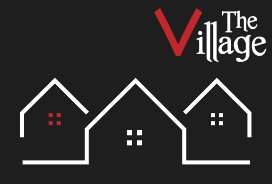

#**The Village**
###A team game for 5-9 players, pitting an uninformed majority against an informed minority.

Players are divided secretly into two teams: **Villagers** & **Bad Guys**. The Bad Guys know each others' identities. The Villagers know nothing about each other. Can the Villagers uncover the Bad Guys hiding in their midst, or will the Bad Guys run this town?

##Tutorial

The Village is a variant of Mafia (or Werewolf), a party game for the quick-witted. Eventually our app will include a player walkthrough, but please refer to this guide for now: 
New player guide: http://wiki.mafiascum.net/index.php?title=Newbie_Guide

##Platform Support
* Android
* iOS
* Windows
* OS X
* Linux
##Release Notes - 0.1 Alpha

Current release is unstable, please wait for compiled binaries. 

##Upcoming Features
* New pre-made setups http://wiki.mafiascum.net/index.php?title=No_Lynching_Town
* Custom setup creation
* Mason messaging system
* Game analytics & lifetime player statistics
